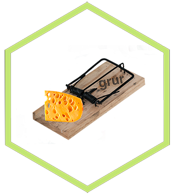

<!-- README.md is generated from README.Rmd. Please edit that file -->

grur
=======================================

<!-- badges: start -->

[](https://tidyverse.org/lifecycle/#experimental)
[](https://travis-ci.org/thierrygosselin/grur)
[](https://ci.appveyor.com/project/thierrygosselin/grur)
[](http://cran.r-project.org/package=grur)
[](http://www.repostatus.org/#active)
[](https://zenodo.org/badge/latestdoi/87596763)
[](commits/master)
[](/commits/master)
<!-- badges: end --> —

<a href="https://thierrygosselin.github.io/grur/" class="uri">https://thierrygosselin.github.io/grur/</a>

The name **grur** \|ɡro͞oˈr\| was chosen because the missing genotypes
dilemma with RADseq data reminds me of the cheese paradox.

Here, I don’t want to sustain a
[war](http://www.lefigaro.fr/flash-eco/2012/12/07/97002-20121207FILWWW00487-le-gruyere-francais-doit-avoir-des-trous.php)
or the controversy of cheese with holes, so choose as you like, the
*French Gruyère* or the *Swiss Emmental*. The paradox is that the more
cheese you have the more holes you’ll get. But, the more holes you have
means the less cheese you have… So, someone could conclude, the more
cheese = the less cheese ? I’ll leave that up to you, back to genomics…

Numerous genomic analysis are vulnerable to missing values, don’t get
trapped by missing genotypes in your RADseq dataset.

Use **grur** to **visualize patterns of missingness** and **perform
map-independent imputations of missing genotypes** (see
[features](https://github.com/thierrygosselin/grur#features) below).

Installation
------------

To try out the dev version of **grur**, copy/paste the code below:

``` r
if (!require("remotes")) install.packages("remotes")
remotes::install_github("thierrygosselin/grur")
library(grur)
```

Options and required packages
-----------------------------

Please follow instructions in the [Notebook
vignette](https://www.dropbox.com/s/5npumwdo0cxtxi4/rad_genomics_computer_setup.nb.html?dl=0)
to install required packages for the selected imputation options below:

<table>
<colgroup>
<col style="width: 25%" />
<col style="width: 34%" />
<col style="width: 39%" />
</colgroup>
<thead>
<tr class="header">
<th style="text-align: left;">imputation options</th>
<th style="text-align: center;">package</th>
<th>install instructions</th>
</tr>
</thead>
<tbody>
<tr class="odd">
<td style="text-align: left;"><strong>imputation.method = “lightgbm”</strong></td>
<td style="text-align: center;"><code>lightgbm</code></td>
<td><a href="https://www.dropbox.com/s/5npumwdo0cxtxi4/rad_genomics_computer_setup.nb.html?dl=0">Notebook vignette</a></td>
</tr>
<tr class="even">
<td style="text-align: left;"><strong>imputation.method = “xgboost”</strong></td>
<td style="text-align: center;"><code>xgboost</code></td>
<td><a href="https://www.dropbox.com/s/5npumwdo0cxtxi4/rad_genomics_computer_setup.nb.html?dl=0">Notebook vignette</a></td>
</tr>
<tr class="odd">
<td style="text-align: left;"><strong>imputation.method = “rf”</strong></td>
<td style="text-align: center;"><code>randomForestSRC</code></td>
<td><a href="https://www.dropbox.com/s/5npumwdo0cxtxi4/rad_genomics_computer_setup.nb.html?dl=0">Notebook vignette</a></td>
</tr>
<tr class="even">
<td style="text-align: left;"><strong>imputation.method = “rf_pred”</strong></td>
<td style="text-align: center;"><code>ranger</code></td>
<td><code>install.packages("ranger")</code></td>
</tr>
<tr class="odd">
<td style="text-align: left;"><strong>imputation.method = “bpca”</strong></td>
<td style="text-align: center;"><code>pcaMethods</code></td>
<td><code>source("https://bioconductor.org/biocLite.R")</code><br><code>biocLite("pcaMethods")</code></td>
</tr>
<tr class="even">
<td style="text-align: left;"><strong>if using pmm &gt; 0</strong></td>
<td style="text-align: center;"><code>missRanger</code></td>
<td><code>install.packages("missRanger")</code></td>
</tr>
</tbody>
</table>

#### Troubleshooting

-   `rmetasim` needs to be modified in order to simulate more than 2000
    markers [notebook
    vignette](https://www.dropbox.com/s/5npumwdo0cxtxi4/rad_genomics_computer_setup.nb.html?dl=0)
-   **Parallel computing**: follow the steps in this [notebook
    vignette](https://www.dropbox.com/s/5npumwdo0cxtxi4/rad_genomics_computer_setup.nb.html?dl=0)
    to install the packages with OpenMP-enabled compiler and conduct
    imputations in parallel.
-   [Installation
    problems.](https://www.dropbox.com/s/5npumwdo0cxtxi4/rad_genomics_computer_setup.nb.html?dl=0)
-   **Windows users**: Install
    [Rtools](https://cran.r-project.org/bin/windows/Rtools/).
-   The R GUI is unstable with functions using parallel ([more
    info](https://stat.ethz.ch/R-manual/R-devel/library/parallel/html/mclapply.html)),
    so I recommend using
    [RStudio](https://www.rstudio.com/products/rstudio/download/) for a
    better experience.
-   Running codes in chunks inside R Notebook might cause problem, run
    it outside in the console.

Features
--------

<table>
<colgroup>
<col style="width: 25%" />
<col style="width: 74%" />
</colgroup>
<thead>
<tr class="header">
<th style="text-align: left;">Caracteristics</th>
<th style="text-align: left;">Description</th>
</tr>
</thead>
<tbody>
<tr class="odd">
<td style="text-align: left;"><strong>Simulate RADseq data</strong></td>
<td style="text-align: left;"><code>simulate_rad</code>: simulate populations of RADseq data following island or stepping stone models. Inside the function, allele frequency can be created with <a href="http://cmpg.unibe.ch/software/fastsimcoal2/">fastsimcoal2</a> and then used inside <a href="https://github.com/stranda/rmetasim">rmetasim</a> simulation engine. <em>Vignette coming soon</em>.</td>
</tr>
<tr class="even">
<td style="text-align: left;"><strong>Patterns of missingness</strong></td>
<td style="text-align: left;"><code>missing_visualization</code>: visualize patterns of missing data associated with different variables of your study (lanes, chips, sequencers, populations, sample sites, reads/samples, homozygosity, etc). Similar to PLINK’s identify-by-missingness analysis (IBM), <strong>grur</strong> is more powerful because it generates more analysis and automatically creates tables and figures. Vignette: <a href="https://www.dropbox.com/s/4zf032g6yjatj0a/vignette_missing_data_analysis.nb.html?dl=0">html</a> and <a href="https://www.dropbox.com/s/5fxw2h9w1l1j391/vignette_missing_data_analysis.Rmd?dl=0">Rmd</a><br><br><code>generate_missing</code>: allows to generate missing genotypes in dateset [simulated] based on a compound Dirichlet-multinomial distribution. <em>Vignette coming soon</em>.</td>
</tr>
<tr class="odd">
<td style="text-align: left;"><strong>Imputations</strong></td>
<td style="text-align: left;"><code>grur_imputations</code>: <strong>Map-independent</strong> imputations of missing genotypes with several algorithms (including machine leaning):<br> * <strong>Random Forests</strong> (on-the-fly-imputations with randomForestSRC or using predictive modelling using ranger and missRanger),<br>* <strong>Extreme Gradient Tree Boosting</strong> (using XGBoost or LightGBM),<br>* <strong>Bayesian PCA</strong> (using bpca in pcaMethods),<br>* <strong>Classic Strawman: </strong> the most frequently observed, non-missing, genotypes is used for imputation.<br><br><strong>Hierarchy: </strong> algorithm’s model can account for <em>strata</em> groupings, e.g. if patterns of missingness is found in the data.<br><br><strong>Haplotypes: </strong> automatically detect SNPs on the same LOCUS (read/haplotype) to impute the SNPs jointly, reducing imputation artifacts. <em>Vignette coming soon</em>.</td>
</tr>
<tr class="even">
<td style="text-align: left;"><strong>Input/Output</strong></td>
<td style="text-align: left;">The imputations offered in <strong>grur</strong> are seamlesly integrated in <strong>radiator</strong> and <strong>assigner</strong>. Imputations are also integrated with usefull filters, blacklists and whitelists inside those 2 packages. Genetic formats recognized: <a href="https://samtools.github.io/hts-specs/">VCF, SNPs and haplotypes</a>, <a href="http://pngu.mgh.harvard.edu/~purcell/plink/data.shtml#tr">PLINK tped/tfam</a>, <a href="https://github.com/thibautjombart/adegenet">genind</a>, <a href="https://github.com/thibautjombart/adegenet">genlight</a>, <a href="https://github.com/EricArcher/strataG">strataG gtypes</a>, <a href="http://genepop.curtin.edu.au">Genepop</a>, <a href="http://catchenlab.life.illinois.edu/stacks/">STACKS haplotype file</a>, <a href="https://github.com/jgx65/hierfstat">hierfstat</a>, <a href="https://www.zsl.org/science/software/colony">COLONY</a>, <a href="http://adn.biol.umontreal.ca/~numericalecology/Rcode/">betadiv</a>, <a href="http://gutengroup.mcb.arizona.edu/software/">δaδi</a>, <a href="http://pritchardlab.stanford.edu/structure.html">structure</a>, <a href="http://cmpg.unibe.ch/software/arlequin35/">Arlequin</a>, <a href="https://github.com/zhengxwen/SNPRelate">SNPRelate</a>, dataframes of genotypes in wide or long/tidy format.</td>
</tr>
<tr class="odd">
<td style="text-align: left;"><strong><a href="http://ggplot2.org">ggplot2</a>-based plotting</strong></td>
<td style="text-align: left;">Visualization: publication-ready figures of important metrics and statistics.</td>
</tr>
<tr class="even">
<td style="text-align: left;"><strong>Parallel</strong></td>
<td style="text-align: left;">Codes designed and optimized for fast computations with progress bars. Works with all OS: Linux, Mac and yes PC!</td>
</tr>
</tbody>
</table>

Vignettes and examples
----------------------

Vignettes with real data for example in the form of R Notebooks take too
much space to be included in package, without CRAN complaining.
Consequently, vignettes will start to be distributed separately, follow
the links below.

-   Missing data visualization and analysis [(html
    vignette)](https://www.dropbox.com/s/4zf032g6yjatj0a/vignette_missing_data_analysis.nb.html?dl=0)
    and
    [(Rmd)](https://www.dropbox.com/s/5fxw2h9w1l1j391/vignette_missing_data_analysis.Rmd?dl=0)

Citation
--------

To get the citation, inside R:

``` r
citation("grur")
```

New features
------------

Change log, version, new features and bug history lives in the [NEWS.md
file](https://github.com/thierrygosselin/grur/blob/master/NEWS.md)

**grur v.0.0.10 2018-04-26**

`grur's` dependencies:

-   I transferred to `Suggests` section these packages: lightgbm,
    missRanger, randomForestSRC, ranger, rmarkdown, rmetasim, strataG,
    xgboost.
-   Functions thate requires specific package will now say so.
-   Reason: people only interested in `missing_visualization` don’t have
    to install all the required packages required for imputations or
    simulations.

`simulate_rad`: with the latest R release (3.5.0), Check now throw a new
note: **Note: next used in wrong context: no loop is visible at
simulate\_rad.R:189** I replaced `next` inside `sapply` with `while`.

**grur v.0.0.9 2017-10-27**

-   `lightGBM` option to conduct the imputations is fully functional

#### Roadmap of future developments

-   Integrate more imputation method.
-   Workflow tutorial to further explore some problems.
-   Use Shiny and ggvis (when subplots and/or facets becomes available
    for ggvis).
-   Until publication **grur** will change rapidly, stay updated with
    releases and contribute with bug reports.
-   Suggestions ?

#### Contributions

This package has been developed in the open, and it wouldn’t be nearly
as good without your contributions. There are a number of ways you can
help me make this package even better:

-   If you don’t understand something, please let me know and raise an
    [issue](https://github.com/thierrygosselin/grur/issues)
-   Your feedback on what is confusing or hard to understand is
    valuable.
-   If you spot a typo, feel free to edit the underlying page and send a
    pull request.
-   New to pull request on github ? [The process is very
    easy](http://r-pkgs.had.co.nz/git.html#git-pullreq).
