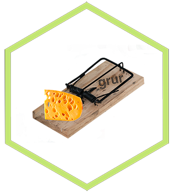

<!-- README.md is generated from README.Rmd. Please edit that file -->

grur 
=====================================================

<!-- badges: start -->

[](https://tidyverse.org/lifecycle/#experimental)
[](https://travis-ci.org/thierrygosselin/grur)
[](https://ci.appveyor.com/project/thierrygosselin/grur)
[](http://cran.r-project.org/package=grur)
[](http://www.repostatus.org/#active)
[](https://zenodo.org/badge/latestdoi/87596763)
[](commits/master)
[](/commits/master)
<!-- badges: end --> —

<a href="https://thierrygosselin.github.io/grur/" class="uri">https://thierrygosselin.github.io/grur/</a>

The name **grur** \|ɡro͞oˈr\| was chosen because the missing genotypes
dilemma with RADseq data reminds me of the cheese paradox.

Here, I don’t want to sustain a
[war](http://www.lefigaro.fr/flash-eco/2012/12/07/97002-20121207FILWWW00487-le-gruyere-francais-doit-avoir-des-trous.php)
or the controversy of cheese with holes, so choose as you like, the
*French Gruyère* or the *Swiss Emmental*. The paradox is that the more
cheese you have the more holes you’ll get. But, the more holes you have
means the less cheese you have… So, someone could conclude, the more
cheese = the less cheese ? I’ll leave that up to you, back to genomics…

Numerous genomic analysis are vulnerable to missing values, don’t get
trapped by missing genotypes in your RADseq dataset.

Use **grur** to **visualize patterns of missingness** and **perform
map-independent imputations of missing genotypes** (see
[features](https://github.com/thierrygosselin/grur#features) below).

Installation
------------

``` r
if (!require("remotes")) install.packages("remotes")
remotes::install_github("thierrygosselin/grur")
library(grur)
```

Note: not all the packages used inside **grur** are installed, why?

-   Depending on your analysis, you might not need to install all of
    them
-   Some modules used for imputations are more complicated to install,
    and might impact your choice of imputations.
-   [this section covers all the required packages
    installation](https://thierrygosselin.github.io/grur/index.html#options-and-required-packages)

web site and additional info <https://thierrygosselin.github.io/grur/> :
------------------------------------------------------------------------

-   [Computer setup - installation -
    troubleshooting](http://thierrygosselin.github.io/grur/articles/rad_genomics_computer_setup.html)
-   [Function’s
    documentation](http://thierrygosselin.github.io/grur/reference/index.html)
-   [grur’s
    features](https://thierrygosselin.github.io/grur/index.html#features)
-   [Vignettes](http://thierrygosselin.github.io/grur/articles/index.html)
-   How to cite grur: inside R type `citation("grur")`

[Life cycle](https://thierrygosselin.github.io/radiator/articles/life_cycle.html)
---------------------------------------------------------------------------------

**grur** is still experimental, in order to make the package better,
changes are inevitable. Experimental functions will change, argument
names will change. Your codes and workflows might break from time to
time **until grur is stable**. Consequently, depending on your tolerance
to change, **grur** might not be for you.

-   Philosophy, major changes and deprecated functions/arguments are
    documented in life cycle section of functions.
-   [changelog, versions, new features and bug
    history](https://thierrygosselin.github.io/grur/news/index.html)
-   [issues](https://github.com/thierrygosselin/grur/issues/new/choose)
    and
    [contributions](https://github.com/thierrygosselin/grur/issues/new/choose)

Options and required packages
-----------------------------

Please follow additional instructions in the
[vignette](http://thierrygosselin.github.io/grur/articles/rad_genomics_computer_setup.html)
to install the required packages for the imputation options you want to
conduct:

| imputation options                 |      package      | install instructions                                                                        |
|:-----------------------------------|:-----------------:|---------------------------------------------------------------------------------------------|
| **imputation.method = “lightgbm”** |     `lightgbm`    | [vignette](http://thierrygosselin.github.io/grur/articles/rad_genomics_computer_setup.html) |
| **imputation.method = “xgboost”**  |     `xgboost`     | [vignette](http://thierrygosselin.github.io/grur/articles/rad_genomics_computer_setup.html) |
| **imputation.method = “rf”**       | `randomForestSRC` | [vignette](http://thierrygosselin.github.io/grur/articles/rad_genomics_computer_setup.html) |
| **imputation.method = “rf\_pred”** |      `ranger`     | `install.packages("ranger")`                                                                |
| **if using pmm \> 0**              |    `missRanger`   | `install.packages("missRanger")`                                                            |

Features
--------

<table>
<colgroup>
<col style="width: 25%" />
<col style="width: 74%" />
</colgroup>
<thead>
<tr class="header">
<th style="text-align: left;">Caracteristics</th>
<th style="text-align: left;">Description</th>
</tr>
</thead>
<tbody>
<tr class="odd">
<td style="text-align: left;"><strong>Simulate RADseq data</strong></td>
<td style="text-align: left;"><code>simulate_rad</code>: simulate populations of RADseq data following island or stepping stone models. Inside the function, allele frequency can be created with <a href="http://cmpg.unibe.ch/software/fastsimcoal2/">fastsimcoal2</a> and then used inside <a href="https://github.com/stranda/rmetasim">rmetasim</a> simulation engine. <em>Vignette coming soon</em>.</td>
</tr>
<tr class="even">
<td style="text-align: left;"><strong>Patterns of missingness</strong></td>
<td style="text-align: left;"><code>missing_visualization</code>: visualize patterns of missing data associated with different variables of your study (lanes, chips, sequencers, populations, sample sites, reads/samples, homozygosity, etc). Similar to PLINK’s identify-by-missingness analysis (IBM), <strong>grur</strong> is more powerful because it generates more analysis and automatically creates tables and figures (<a href="https://thierrygosselin.github.io/grur/articles/vignette_missing_data_analysis.html">see vignette</a>). <br><br><code>generate_missing</code>: allows to generate missing genotypes in dateset [simulated] based on a compound Dirichlet-multinomial distribution. <em>Vignette coming soon</em>.</td>
</tr>
<tr class="odd">
<td style="text-align: left;"><strong>Imputations</strong></td>
<td style="text-align: left;"><code>grur_imputations</code>: <strong>Map-independent</strong> imputations of missing genotypes with several algorithms (including machine leaning):<br> * <strong>Random Forests</strong> (on-the-fly-imputations with randomForestSRC or using predictive modelling using ranger and missRanger),<br>* <strong>Extreme Gradient Tree Boosting</strong> (using XGBoost or LightGBM),<br>* <strong>Bayesian PCA</strong> (using bpca in pcaMethods),<br>* <strong>Classic Strawman: </strong> the most frequently observed, non-missing, genotypes is used for imputation.<br><br><strong>Hierarchy: </strong> algorithm’s model can account for <em>strata</em> groupings, e.g. if patterns of missingness is found in the data.<br><br><strong>Haplotypes: </strong> automatically detect SNPs on the same LOCUS (read/haplotype) to impute the SNPs jointly, reducing imputation artifacts. <em>Vignette coming soon</em>.</td>
</tr>
<tr class="even">
<td style="text-align: left;"><strong>Input/Output</strong></td>
<td style="text-align: left;"><strong>grur</strong> uses <a href="https://thierrygosselin.github.io/radiator/index.html">radiator</a> input and output modules. Check out the <a href="https://thierrygosselin.github.io/radiator/articles/get_started.html#overview">overview</a> of</td>
</tr>
<tr class="odd">
<td style="text-align: left;">supported file format</td>
<td style="text-align: left;"></td>
</tr>
<tr class="even">
<td style="text-align: left;"><strong><a href="http://ggplot2.org">ggplot2</a>-based plotting</strong></td>
<td style="text-align: left;">Visualization: publication-ready figures of important metrics and statistics.</td>
</tr>
<tr class="odd">
<td style="text-align: left;"><strong>Parallel</strong></td>
<td style="text-align: left;">Codes designed and optimized for fast computations with, sometimes, progress bars. Works with all OS: Linux, Mac and yes PC!</td>
</tr>
</tbody>
</table>
