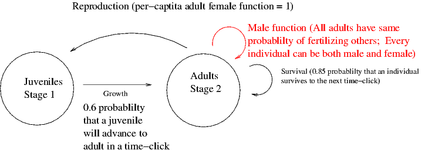
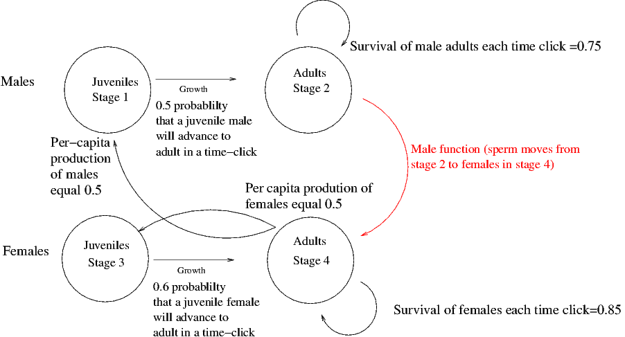

```{r setup, include=FALSE}
knitr::opts_chunk$set(echo = TRUE)
```

The easiest simulations to parameterize in rmetasim are ones in which hermaphroditic individuals are simulated.  This works really well in the majority of cases.  There are times, however, where simulating more complex sexuality and mating is required.  No problem, but more complex sexuality means more complex parameterization.

I find that drawing a picture that illustrates the fate of individuals each time-click is very helpful

##Hermaphrodites
The following figure illustrates a simple life-cycle.



The local demography matrices that encode this demography look like this (remember transitions go **from** columns **to** rows):

```{r, echo=F}
LocalS = matrix(c(0, 0, 0.6, 0.85),byrow=T,ncol=2)
LocalR = matrix(c(0, 1, 0, 0),byrow=T,ncol=2)
LocalM = matrix(c(0, 0, 0, 1),byrow=T,ncol=2)

print("LocalS:")
LocalS
print("LocalR:")
LocalR
print("LocalM:")
LocalM

```

##Dioecy with equal probability of producing males and females from a mating



Here are the local-demographic matrices.  Now there are 4 stages within a population: male juveniles (1), male adults(2), female juveniles(3) and female adults (4)


```{r,echo=F}
LocalS = matrix(c(0, 0, 0, 0,
                  0.5,  0.75, 0, 0,
                  0, 0, 0, 0,
                  0, 0, 0.6, 0.85),byrow=T,ncol=4)

LocalR = matrix(c(0, 0, 0, 0.5,
                  0,  0, 0, 0,
                  0, 0, 0, 0.5,
                  0, 0, 0, 0),byrow=T,ncol=4)

LocalM = matrix(c(0, 0, 0, 0,
                  0,  0, 0, 1,
                  0, 0, 0, 0,
                  0, 0, 0, 0),byrow=T,ncol=4)

print("LocalS:")
LocalS
print("LocalR:")
LocalR
print("LocalM:")
LocalM

```


One could imagine additional elements in the LocalS matrix that might encode changes in sexuality during the course of an individual's life.
